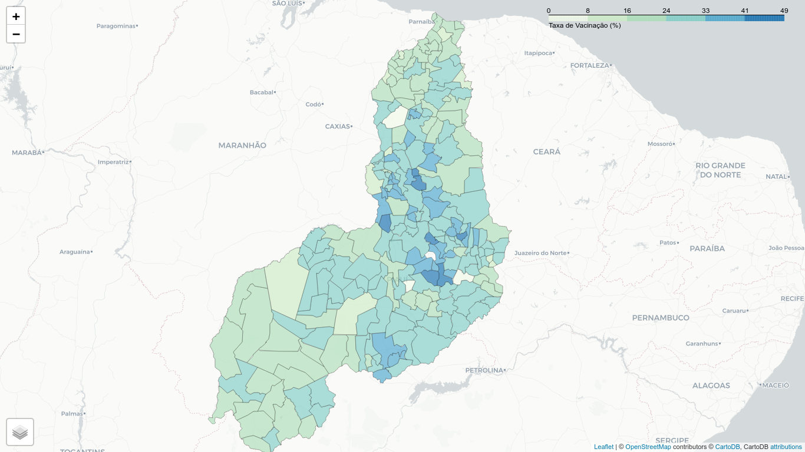
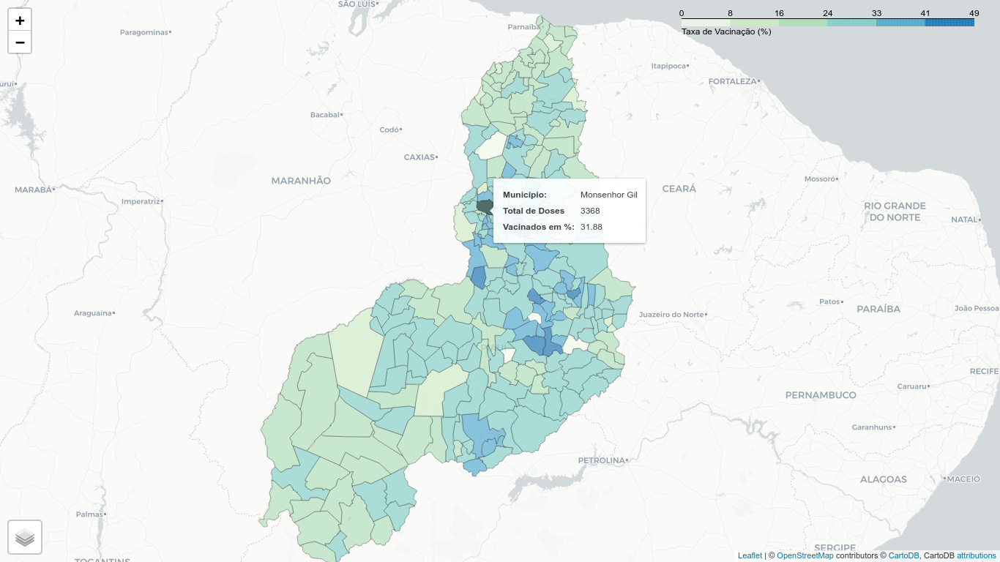

# Vacinados Piauí Folium

Apresentação dos dados de vacinação do estado do Piauí por meio de Mapa [Choropleth](https://python-visualization.github.io/folium/quickstart.html) por meio da biblioteca python [Folium](https://python-visualization.github.io/folium/index.html)

# Imagens

 <br/>


# Início Rápido

```bash
python3 -m venv myenv
source myenv/bin/activate
pip install -r requirements.txt
python .
```

# Tecnologias utilizadas

- [Folium](https://python-visualization.github.io/folium/installing.html)
- [Geo Pandas](https://pypi.org/project/geopandas/)
- [Pandas](https://pandas.pydata.org/)

# Dados

Dados disponíveis no [Painel Epidemiológico Covid-19 • Piauí](https://datastudio.google.com/reporting/a6dc07e9-4161-4b5a-9f2a-6f9be486e8f9/page/d06pB)

> Atenção! Até o momento o projeto ainda se trata de um teste.
